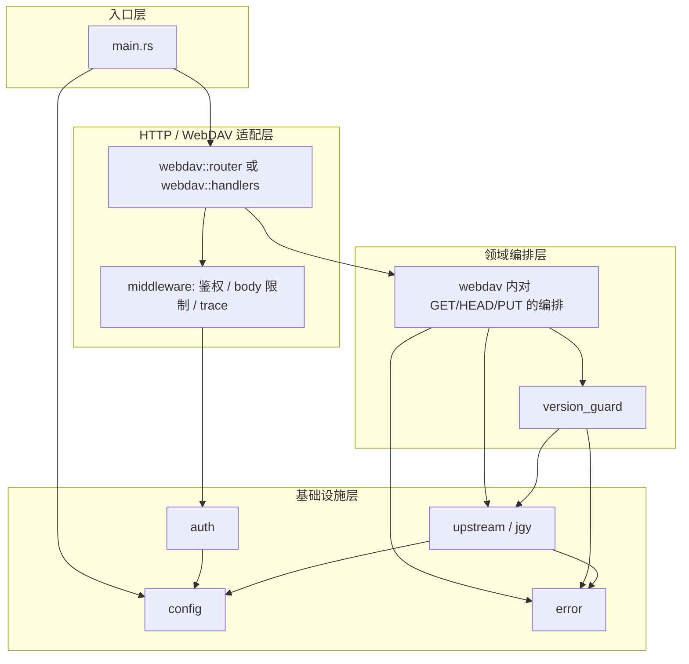

# 项目代码架构与目录设计（评审稿）

| 项 | 内容 |
|----|------|
| 状态 | 草案，待评审 |
| 版本 | 0.1 |
| 日期 | 2026-04-22 |
| 依据 | `docs/坚果云中继-设计说明.md` v0.1（本文不修改该文档，仅对齐其 §5–§8、§11） |

---

## 1. 文档目的

说明 **Rust 工程如何落地**《坚果云中继-设计说明》中的逻辑划分：代码分层、模块边界、依赖方向、目录与文件职责，供实现前评审。实现阶段可在不违背边界的前提下微调文件名。

---

## 2. Crate 策略

| 决策 | 说明 |
|------|------|
| **一期：单 Package、单 Binary** | 工程名与 `Cargo.toml` 中 `[package] name` 一致（当前为 `jian_guo_yun_relay`），产出单一服务端可执行文件。复杂度与规模适合单 crate，减少跨 crate 协调成本。 |
| **`src/lib.rs`（推荐）** | 将可复用核心（配置、上游客户端、版本守卫、WebDAV 处理）放在 **library 根**，`src/main.rs` 仅负责 **启动、信号处理、绑定监听**。便于集成测试 `use jian_guo_yun_relay::...` 与单元测试。若团队更偏好「纯 bin」，可合并进 `main.rs`，但测试会略不便。 |
| **Workspace 多 crate** | **本期不做**。若未来出现独立 CLI、或与核心无关的工具，再拆 `crates/relay`、`crates/xtask` 等。 |

---

## 3. 逻辑分层与依赖方向

自上而下调用关系（**下层不得依赖上层**）：



**与设计说明 §11 的对应关系**

| 设计 §11 模块 | 代码落点（本文约定） |
|---------------|----------------------|
| `config` | `src/config/` 或 `src/config.rs` + 子模块 `validate` |
| `auth` | `src/auth.rs` 或 `src/auth/mod.rs` |
| `upstream` / `jgy` | `src/upstream/`（对外类型名可用 `NutstoreClient` 等，与「坚果云」语义一致） |
| `webdav` | `src/webdav/` |
| `version_guard` | `src/version_guard.rs` 或 `src/version_guard/mod.rs` |
| `main` | `src/main.rs` + 可选 `src/bootstrap.rs`（监听、graceful shutdown） |

---

## 4. 各层职责摘要

### 4.1 `main` / `bootstrap`

- 读取环境变量或配置文件，调用 `config` 校验（必填项、URL 形态、`MAX_BODY_BYTES` 等）。
- 初始化 `tracing` / `tracing-subscriber`（日志格式、级别）。
- 构建 **`AppState`**（见 §6）：共享 `Arc<Config>`、`NutstoreClient`（或 `reqwest::Client` 封装）。
- 组装 **Axum Router**（来自 `webdav`），绑定 `LISTEN_ADDR`；可选注册 **SIGTERM 优雅退出**。
- **不**实现具体 WebDAV 业务逻辑。

### 4.2 `webdav`（HTTP / WebDAV 适配层）

- 将 **HTTP 方法 + 路径** 映射到处理函数：`OPTIONS`、`HEAD`、`GET`、`PUT`、`PROPFIND`（设计 §6.2）。
- 解析 WebDAV 相关头：`Depth`、`If-Match`、（可选）`X-Base-ETag`（设计 §7.3）。
- **GET/HEAD**：调用 `upstream` 转发，并将 `ETag`、`Content-Length`、`Content-Type` 等按设计透传或裁剪。
- **PUT**：先调用 `version_guard::pre_put_check(...)`，通过后调用 `upstream::put`；失败路径 **不调用** `put`。
- **PROPFIND**：生成设计约定的 **最小 XML**（独立小模块便于单测，如 `webdav/propfind.rs`）。
- 将 `upstream::Error` 与守卫失败统一映射为 HTTP 状态码（与 `error` 模块协作）。

### 4.3 `version_guard`（设计 §7.3 层 B）

- 输入：客户端提供的基准版本（`If-Match` 与/或 `X-Base-ETag`）、当前请求上下文。
- 行为：对坚果云同一资源 **`HEAD`（或约定降级）** 取当前 `ETag`，与基准比较；不一致则返回 **守卫错误**（由上层映射为 409/412，具体码以设计说明定稿为准）。
- **仅依赖** `upstream` + 纯逻辑类型；**不**依赖 Axum（便于单元测试）。

### 4.4 `upstream` / `jgy`

- 封装对 `JGY_WEBDAV_ROOT` + `JGY_REMOTE_PATH` 的 **GET / HEAD / PUT**。
- **Basic Auth**（坚果云账号 + 应用密码）；**TLS 校验**、**超时**（设计 §5.2、§8）。
- （实现时建议）**主机白名单**：仅允许连接设计约定的坚果云 WebDAV 主机，避免配置误用导致 SSRF——与安全评审建议对齐，属实现细节，本架构文档占位说明。
- 返回 **结构化错误**（超时、4xx、5xx、412 等），**不**记录响应 body。

### 4.5 `auth`

- 校验公司端访问中继的凭据（设计 §5.3：Basic / Bearer 等）。
- 以 **常量时间比较** 秘密；失败返回 **401**。
- 可作为 **Axum Layer** 或在各 handler 前统一中间件调用。

### 4.6 `config`

- 从环境变量加载设计 §8 所列项；启动时 **fail-fast**（缺项、非法 URL、过大/过小上限）。
- 提供 **已解析类型**（如 `Url`、`Duration`、用户名口令结构体），避免在业务层重复解析。

### 4.7 `error`

- 定义 `AppError` / `RelayError` 枚举，实现 `IntoResponse` 或映射函数，统一 **状态码 + 可选极简 JSON/空 body**（避免泄露内部细节）。
- `upstream` 与 `version_guard` 的错误类型可 `From` 转换聚合到此。

---

## 5. 共享状态 `AppState`

建议单一结构体，经 `Arc<AppState>` 注入 Axum：

| 字段 | 用途 |
|------|------|
| `config: Arc<Config>` | 只读配置 |
| `nutstore: NutstoreClient` | 内含 `reqwest::Client`（或等价），连接池复用 |
| （可选）`rate_limit` 状态 | 若实现 §5.5 限流，可挂在此处或独立 Layer |

**原则**：不在 `AppState` 中存放可变「会话库」；单用户场景下 **无服务端会话** 即可满足设计。

---

## 6. 目录与文件设计（推荐树）

以下为 **一期推荐布局**；`lib.rs` 与「仅 main」二选一已在 §2 说明，下列按 **含 lib.rs** 写法列出。

```
JianGuoYunRelay/
├── Cargo.toml
├── README.md                          # 部署与运行入口说明（与本文档区分职责）
├── docs/
│   ├── 坚果云中继-设计说明.md          # 产品/协议/安全需求（上游）
│   └── 代码架构与目录设计.md          # 本文档
├── src/
│   ├── main.rs                        # 进程入口：bootstrap、run
│   ├── lib.rs                         # pub mod config; pub mod ... 对外导出供 tests 使用
│   ├── bootstrap.rs                 # 可选：tracing、TcpListener、shutdown 信号
│   ├── state.rs                     # AppState 定义与构造
│   ├── config/
│   │   ├── mod.rs                   # Config 结构体 + load_from_env
│   │   └── validate.rs              # 可选：URL/路径校验、主机白名单常量
│   ├── auth.rs                      # 或 auth/mod.rs + basic.rs
│   ├── error.rs                     # 统一错误与 IntoResponse
│   ├── version_guard.rs             # PUT 前 HEAD + ETag 比对
│   ├── upstream/
│   │   ├── mod.rs                   # re-export NutstoreClient
│   │   ├── client.rs                # get/head/put 实现
│   │   └── types.rs                 # 上游响应元数据（etag, status）
│   └── webdav/
│       ├── mod.rs                   # 注册路由、合并子模块
│       ├── handlers.rs              # options, head, get, put 的 axum handler
│       └── propfind.rs              # PROPFIND 响应体构建
├── tests/
│   └── integration_placeholder.rs   # 可选：mock 上游后对 GET/PUT/412 的集成测试
└── .env.example                     # 可选：列出 §8 环境变量占位（勿提交真实密钥）
```

### 6.1 文件职责速查

| 路径 | 职责 |
|------|------|
| `src/main.rs` | `#[tokio::main]`，调用 `bootstrap::run()` 或等价。 |
| `src/lib.rs` | 声明各 `mod`；必要时 `pub use` 供集成测试。 |
| `src/bootstrap.rs` | 组装 `Router`、监听、Server `with_graceful_shutdown`。 |
| `src/state.rs` | `AppState` 与 `FromRef`（若使用 Axum 0.7+ 子状态拆分）。 |
| `src/config/*` | 配置模型与校验；与设计 §8 一一对应。 |
| `src/auth.rs` | 中继侧鉴权中间件或函数。 |
| `src/error.rs` | HTTP 层错误映射。 |
| `src/version_guard.rs` | 设计 §7.3 层 B，仅编排 + 调用 `upstream::head`。 |
| `src/upstream/*` | 设计 §5.2、§6、§7 中与坚果云的所有 HTTP 交互。 |
| `src/webdav/*` | 对外 WebDAV 子集；**唯一**依赖 Axum 的 HTTP 细节集中地。 |
| `tests/*` | 使用 `jian_guo_yun_relay` library，对 `webdav` + mock `upstream` 做黑盒测试（按需添加 `wiremock` 等）。 |

### 6.2 路径映射 M1 / M2 对目录的影响

- **M2（设计推荐）**：`webdav::handlers` 中可将 **对外 URI 固定**（如 `/vault.kdbx`），`upstream` 仅使用配置中的单一 `JGY_REMOTE_PATH`，**无需**动态路径拼接模块。  
- **M1**：可增加 `src/webdav/path_map.rs`，将中继路径映射到坚果云路径；鉴权通过后解析路径段。

本文树按 **M2 优先** 简化；若评审选定 M1，在 `webdav` 下增加映射模块即可，**不改变** `upstream` 与 `version_guard` 边界。

---

## 7. 主要依赖建议（实现时锁定版本）

| 用途 | 建议 crate | 备注 |
|------|------------|------|
| 异步运行时 | `tokio` | full features 按需开启 `rt-multi-thread`、`macros` |
| HTTP 服务 | `axum` | 与 `tower` / `tower-http` 配合 |
| 中间件 | `tower-http` | `trace`、`limit`（body size）等 |
| 上游 HTTP | `reqwest` | 默认 **启用 TLS**；与设计 upstream 一致 |
| 序列化（若配置用文件） | `serde` | 环境变量为主时仍可用于未来扩展 |
| 日志 | `tracing`, `tracing-subscriber` | 与设计 §5.4 一致 |

**不在架构层强制**：具体 TLS backend（`rustls` vs `native-tls`）由实现阶段与运维环境决定。

---

## 8. 测试策略（与目录配合）

| 类型 | 位置 | 目标 |
|------|------|------|
| 单元测试 | 各模块 `#[cfg(test)] mod tests` | `version_guard` 的 ETag 比较逻辑、`propfind` XML 片段、`config::validate` |
| 集成测试 | `tests/*.rs` | 起 **本地 Axum** + **mock 坚果云**（如 `wiremock`），验证 GET 透传 ETag、PUT 预检失败时不命中 mock PUT |

---

## 9. 与设计说明的差异说明

- 设计 §11 使用 `jgy` 命名；代码目录采用 **`upstream`** 仅为通用性，**语义仍为坚果云 WebDAV**；若评审要求目录名与文档一致，可将 `upstream/` 重命名为 `jgy/`。  
- 设计 §12 未定稿项（M1/M2、409/412、LOCK 等）**不改变**本文模块边界，只影响 **`webdav` 与 `version_guard` 内分支** 的实现细节。

---

## 10. 评审检查清单

- [ ] 是否同意 **单 crate + lib/main 分离** 策略  
- [ ] `webdav` / `version_guard` / `upstream` 三层边界是否清晰  
- [ ] 目录树是否覆盖设计 §6 方法集与 §7 版本守卫的实现落点  
- [ ] `tests/` 与 mock 上游的集成测试策略是否可接受  
- [ ] M1 选中时，是否接受在 `webdav` 下增加 `path_map` 扩展点  

**评审人 / 日期 / 修订意见：**

```
（在此记录）


```

---

## 11. 修订记录

| 版本 | 日期 | 说明 |
|------|------|------|
| 0.1 | 2026-04-22 | 初稿，依据《坚果云中继-设计说明》v0.1 |
